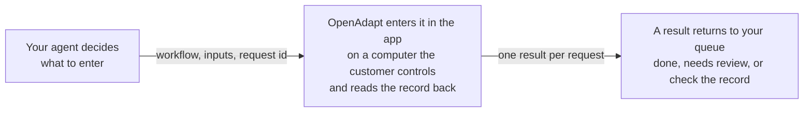

# OpenAdapt Agent

[](LICENSE)
[](https://www.python.org/downloads/)

Your AI agent decides what to enter. OpenAdapt enters it in the app and checks that it saved.

Your agent already reads the referral, the intake form, or the authorization and works out what belongs in the record. Today a person still opens the EMR or the payer portal and types it in again. OpenAdapt takes that last step off your customer's team. It enters the approved values in the app they already use, on a computer they control, and then reads the saved record back. When something doesn't match, it stops and asks a person instead of guessing.

## How it fits



Your agent sends the name of a saved task, the values to enter, and its own id for the piece of work. OpenAdapt does the entry in the same screens staff use, reads the saved record back, and returns one result to your queue.

## What changes for your customer's team

| Step | Today | With OpenAdapt |
| --- | --- | --- |
| Read the document and decide what to enter | Your agent | Your agent |
| Open the app and find the right record | Staff | OpenAdapt, which confirms it has the right record before it types |
| Type the values and save | Staff, re-keying your agent's output | OpenAdapt, in the same screens staff use |
| Confirm the entry saved | Usually nobody, unless a spot check catches it | OpenAdapt reads the saved record back before it reports done |
| Something doesn't match | Found later, or not at all | OpenAdapt stops and a person decides |
| What staff handle | Every item | Only the items that stopped |

For scale, two hospital time studies put keying one faxed referral into an EHR at about 10 to 12 minutes (UCSF, JAMIA Open 2020; Calderdale and Huddersfield NHS Foundation Trust, HFMA 2024). This page doesn't estimate time saved. Measure it on your own workflow.

## What your agent gets back

Every request ends in one of four outcomes. Each one tells your agent what to do next.

| `outcome` | Plain label | What it means | What your agent does |
| --- | --- | --- | --- |
| `done` | Done and checked | OpenAdapt saved the entry and read the record back to confirm it. | Marks the item complete and keeps the `run_id`. |
| `needs_review` | Stopped before saving | Something didn't match, so it stopped before changing anything. Nothing was written. A person decides. | Waits. It doesn't start the same work again. |
| `not_sure_if_saved` | Check the record | A save may have gone through. A person checks the record before anything is retried. | Never retries. It routes the item to the person who checks. |
| `did_not_run` | Didn't run | It didn't start, so nothing was written. | Fixes the cause, such as a bad input, and retries with the same request id. |

Each result also carries `safe_to_retry`, one plain sentence in `what_happened`, a `next_action`, and `proof`. `proof` is `local` when the record check ran on the customer's computer. It's never a reason to report a saved entry as a failure.

## Three tools

Your agent needs three calls.

1. `list_workflows` returns each saved task's `name`, `purpose`, what `done_means`, and its typed `inputs`.
2. `run_workflow` takes `workflow`, `inputs`, `request_id`, and an optional `wait_seconds`.
3. `get_run` takes a `run_id` and returns the result of a run that was still going.

`request_id` is your own id for the piece of work, such as the referral id. It's required. If your agent sends the same `request_id` again, it gets the first result back and nothing is entered a second time. A new attempt starts only when the first one proved nothing was written.

Here is a real result from the sandbox. The synthetic app saved the note and then showed an error, so OpenAdapt can't confirm the save and says so:

```json
{
  "outcome": "not_sure_if_saved",
  "label": "Check the record",
  "safe_to_retry": false,
  "what_happened": "OpenAdapt can't confirm whether the change was saved. It may have gone through. This was a sandbox run on a synthetic app; no real record was touched.",
  "next_action": "Have a person check the record in the app before anything runs again. Don't retry this request.",
  "record_changed": "unknown",
  "proof": "none",
  "workflow": "add_triage_note",
  "request_id": "demo-timeout-after-save",
  "run_id": "run-68ecc09407a3417190aa3e96",
  "model_calls": 0
}
```

Measured on synthetic data. The full set, one result per case, is in [`docs/examples/sandbox-results.json`](docs/examples/sandbox-results.json).

## Who builds what

| You build | OpenAdapt provides |
| --- | --- |
| The agent that reads documents and decides what to enter | An automation built from one recording of a person doing the task in the real app |
| The call to `run_workflow`, with your own request id | The run on a computer the customer controls, with a right-record check before it types and a record check after it saves |
| What your product does with each outcome | Stops that go to a person, a durable record of every run, and the first result back for a repeated request id |
| Your tests against the four outcomes | A sandbox that returns each outcome on demand |

Your customer provides a computer that can already open the app and a person who handles the items that stop. A normal run sends nothing to an AI model.

## Try it

The sandbox needs no account and no flags. It serves one workflow, `add_triage_note`, on MockMed, a synthetic clinic app with made-up patients. Pick a `sandbox_case` to see each outcome.

```bash
claude mcp add openadapt -- uvx --python 3.12 --from git+https://github.com/OpenAdaptAI/openadapt-agent openadapt-agent serve
```

PyPI has openadapt-agent 2.0.1, which predates the sandbox. From version 2.0.2 on, this shorter line does the same:

```bash
claude mcp add openadapt -- uvx --python 3.12 openadapt-agent serve
```

Then ask your agent something like: "Use OpenAdapt to add the triage note 'Synthetic: recheck blood pressure in 2 weeks' with request id demo-0001. Then try the false_saved_banner case."

| `sandbox_case` | `outcome` | What the synthetic app does |
| --- | --- | --- |
| `normal` (default) | `done` | Saves the note. The record check finds it in the app's record store. |
| `duplicate_record` | `needs_review` | Lists the same referral twice, so OpenAdapt can't be sure which record to open. It stops before saving. |
| `false_saved_banner` | `not_sure_if_saved` | Shows a saved message, but its record store rejected the note. |
| `timeout_after_save` | `not_sure_if_saved` | Saves the note, then times out and shows an error. Only a person checking the record can tell it saved. |
| `app_offline` | `did_not_run` | Isn't reachable, so nothing starts. |

A plain install returns simulated results and says so in every result. Add the `tutorial` extra to drive the synthetic app in a hidden browser with the real OpenAdapt engine. The first run downloads a browser and records the workflow once:

```bash
claude mcp add openadapt -- uvx --python 3.12 --from 'openadapt-agent[tutorial] @ git+https://github.com/OpenAdaptAI/openadapt-agent' openadapt-agent serve
```

Pick one task your agent hands to staff today, and [talk to us about connecting it](https://openadapt.ai/qualify?why=embed). Public examples use synthetic apps and data. Each new environment gets a readiness test on its own system before it handles real records.

## Developer setup

Python 3.10 through 3.12. This package is a local MCP server over stdio. Claude Code, Cursor, Codex, and your own MCP client can use it. It runs on the computer that can open the app.

### Modes

| Command | What it serves |
| --- | --- |
| `openadapt-agent serve` | The sandbox. Tools: `list_workflows`, `run_workflow`, `get_run`. |
| `openadapt-agent serve --bundles DIR` | Your compiled workflows, read-only: they're listed, not run. |
| `openadapt-agent serve --mode production --bundles DIR` | Your workflows, with runs. |
| `openadapt-agent serve --mode attended --bundles DIR --config deployment.yaml --headed` | Runs, plus decisions on paused runs by a person at this computer. |

Operator bundles always run through the governed `openadapt-flow run` command, so every admission gate in [openadapt-flow](https://github.com/OpenAdaptAI/openadapt-flow) still applies. Results and run records live under `--runs-dir` (default `./runs`; the sandbox uses `~/.openadapt/agent-sandbox`).

If your agent runs in your cloud rather than on the customer's computer, it can't reach this stdio server. [Talk to us](https://openadapt.ai/qualify?why=embed) about the hosted route.

### Describe a workflow for agents

`list_workflows` reads types and choices from the compiled workflow. Add an `openadapt-card.json` next to the bundle's `workflow.json` to give it a name, a purpose, and input descriptions:

```json
{
  "name": "enter_referral",
  "purpose": "Create an outgoing referral for an existing patient in the clinic EMR.",
  "done_means": "The referral appears in the EMR's referral report for that patient.",
  "inputs": {
    "patient_mrn": {"description": "Clinic MRN of the patient.", "pattern": "^[0-9]{6,10}$"},
    "referral_date": {"description": "Date of the referral.", "format": "date"}
  }
}
```

Card text goes to the calling agent and, through it, to a hosted model. Never put patient details in it. The server ignores a card that looks like it carries an identifier and logs a warning on this computer.

### Technical details

Results come from openadapt-flow's `transaction_outcome`, never from the coarse halt label alone.

| Flow `transaction_outcome` | `outcome` | `safe_to_retry` |
| --- | --- | --- |
| `VERIFIED` | `done` | false |
| `HALTED_BEFORE_EFFECT` | `needs_review` | false |
| `REJECTED_POLICY`, `CANCELED`, `FAILED_PLATFORM` while a durable pause is open | `needs_review` | false |
| `REJECTED_POLICY`, `CANCELED`, `FAILED_PLATFORM` with no open pause | `did_not_run` | true |
| `RECONCILIATION_REQUIRED`, `COMPLETED_UNVERIFIED`, `ROLLED_BACK` | `not_sure_if_saved` | false |
| A timeout after Flow started, an unreadable report, or a server that stopped mid-run | `not_sure_if_saved` | false |
| An admission refusal before Flow started, with closed `failed_checks` codes | `did_not_run` | true |
| A person ended the run at its pause | `did_not_run` | false |

`reason` names the case from a closed list, and `technical` carries Flow's exact `execution_outcome` and `transaction_outcome`. `needs_attention_id` points at the local Needs Attention item when there is one. `receipt_url` and `review_url` are reserved for the hosted service; this local server leaves them out. `run_workflow` and `get_run` publish an MCP `outputSchema` and return `structuredContent`. The schema is `RUN_RESULT_SCHEMA` in [`src/openadapt_agent/contract.py`](src/openadapt_agent/contract.py).

Each attempt reserves `<request>:<attempt>` in openadapt-flow's `IdempotencyLedger` before anything runs. Run records hold the result only. Inputs are never stored; a keyed fingerprint catches a `request_id` reused with different inputs.

### Older tools and flags

Existing clients keep working. With `--bundles`, the server also registers the older tools:

| Tool | Status |
| --- | --- |
| `get_workflow`, `get_run_report`, `list_needs_attention`, `get_attention_item` | Kept. `get_run_report` also finds runs started with `run_workflow`. |
| `run_workflow_<opaque-id>` | Deprecated. Use `run_workflow`, which takes a request id. The old tools now return the same `outcome`, `safe_to_retry`, and `what_happened` fields, and a verified run reports `success` with `proof: "local"`. |
| `reject_attention`, `teach_attention`, `escalate_attention` | `--mode attended` (or `--allow-attended-actions`) |
| `continue_attention`, `skip_attention` | `--mode attended` plus a qualified deployment `--config` |

`openadapt-agent serve --allow-run` is the older form of `--mode production` when you pass `--bundles`, and of the sandbox when you don't. `--tutorial` is the older name for the sandbox. `--allow-attended-actions` is part of `--mode attended`.

### Trust boundary

Don't expose this process's stdin and stdout as an unauthenticated network service. It inherits the local user's OS permissions, and Flow records that OS account as the operator for attended decisions.

By default every MCP response is safe to render outside the protected workflow-data boundary. Labels, recorded values, paths, raw reports, observed text, stdout, stderr, and local exception messages stay on this computer. The client gets workflow cards, fixed outcome copy from a closed list, opaque ids, and count or boolean metrics.

`--allow-protected-export` sends raw local metadata and evidence to the MCP client. Use it only when that client is trusted and inside the same protected data boundary.

`--allow-synthetic-recorded-defaults` lets omitted inputs reuse recorded values. It requires runs. Synthetic demonstrations only: production runs require every declared input so a wrong-record entry can't hide in a default.

Remote transport, account identity, tenant isolation, fleet policy, and managed execution belong to OpenAdapt Cloud. They aren't duplicated here. The complete design is in [docs/DESIGN.md](docs/DESIGN.md).

### Finish a paused run

`continue_attention` doesn't perform the paused action again. Point the server at Flow's qualified deployment config when a person at this computer finishes an exception and continues the same durable run:

```bash
openadapt-agent serve \
  --mode attended \
  --bundles /opt/openadapt/bundles \
  --runs-dir /var/lib/openadapt/runs \
  --config /etc/openadapt/deployment.yaml \
  --headed
```

| Tool | What happens |
| --- | --- |
| `continue_attention` | The person confirms they completed the paused task in the live app. Flow rechecks the screen and the record, checkpoints it as done by a person, and resumes after it. |
| `skip_attention` | Flow applies only an already-declared skip that changes no record. |
| `reject_attention` | Ends this run and dispatches no new action. Earlier steps can still have effects, so read the protected local report. |
| `teach_attention` | Records an audited request for a corrective demonstration. |
| `escalate_attention` | Records an audited escalation and leaves the pause in place. |

Every decision needs the queue item id, its current capability digest, a stable idempotency key, and an action-specific `true` confirmation. The server then asks the person to confirm through MCP form elicitation. Clients without form elicitation use Flow's attended console instead:

```bash
openadapt-flow console --attend --allow-actions \
  --bundles /opt/openadapt/bundles --runs /var/lib/openadapt/runs \
  --config /etc/openadapt/deployment.yaml --headed
```

After a person decides, `get_run` shows the new outcome.

### Record a first workflow with your agent

`--authoring` adds first-demo tools over the same local stdio server: `observe`, `start_record`, `click`, `halt`, `type`, `pause_for_input`, `continue_input`, `stop_record`, `compile`, `admit`, and helpers. It doesn't enable runs.

```bash
claude mcp add openadapt-authoring -- uvx --python 3.12 --from 'openadapt-agent[tutorial] @ git+https://github.com/OpenAdaptAI/openadapt-agent' openadapt-agent serve --authoring
```

Pass `--url --headed` to open a fresh Playwright Chromium with empty cookies, and sign in there during `pause_for_input`. Windows native, Citrix, and RDP sessions are coach-only here. Hosted ChatGPT.com and Claude.ai can't reach localhost stdio; send them to https://openadapt.ai/start. Once a job exists at `https://openadapt.ai/j/{id}`, `openadapt-agent authoring connect` claims it over outbound HTTPS (the job page should offer `openadapt connect <url>`). See [docs/MAILBOX_CLI.md](docs/MAILBOX_CLI.md).

To see the engine on its own without an agent, `openadapt flow tutorial` runs the synthetic app from the OpenAdapt launcher, and `openadapt quickstart --break-it` shows a fake saved message caught by the record check.

### Agent Skills

`openadapt-agent emit-skill BUNDLE --out ~/.claude/skills` writes a skill for one workflow from its card: purpose, inputs, how to call `run_workflow`, and how to read the four outcomes. A skill is loaded into model context, so it carries no recorded values, step text, or secrets, and each skill's description names its own workflow. `--include-bundle` also copies the compiled bundle, which is protected workflow data. A first-party skill lives at [`skills/openadapt-gui-write/SKILL.md`](skills/openadapt-gui-write/SKILL.md). The skill is named after the workflow, never "computer use".

### Product state

An exact Agent release enters Production only through an active signed admission. That admission expires and can be revoked. A missing, expired, revoked, mismatched, or unverifiable admission produces **not actively admitted**. The validator doesn't restore an older admission or assign a fallback lifecycle label.

Check the [current signed Production record](https://openadapt.ai/production-lifecycle.json). That ledger currently has seven target admissions. Evidence class is `remote-safe-synthetic`.

Standard and Regulated runs also need an active workflow admission for the exact bundle version. Demo and the synthetic sandbox may run without one. The public workflow ledger is [production-workflow-admissions.json](https://openadapt.ai/production-workflow-admissions.json). It lists seven synthetic admissions (`0.0.0-synthetic`). That isn't a customer job.

### Package history and listings

Before v2 this repository wrapped model-driven GUI agents. The execution path now lives in `openadapt-flow`. The name stays because the package connects agents to it over MCP and Agent Skills.

A customer's compiled workflow is their private artifact. Supply it at launch with `--bundles`. It is never embedded in the package or a registry listing. See [`docs/DISTRIBUTION.md`](docs/DISTRIBUTION.md).

The MCP registry reads [`server.json`](server.json). Smithery packs from [`manifest.json`](manifest.json). [`llms.txt`](llms.txt) exists because hosted assistants read a file, not this README. Registry-launched installs start read-only.

`mcp-name: io.github.OpenAdaptAI/openadapt-agent`

### Development

```bash
pip install -e ".[dev]"
ruff check src tests scripts
pytest -q
OPENADAPT_AGENT_E2E=1 pytest -q tests/test_sandbox_flow.py   # needs .[tutorial] and Chromium
python scripts/smoke_client.py                                  # the sandbox over real stdio
python -m build
python scripts/check_release_artifacts.py dist
python scripts/check_dist.py dist/*
npx -y @anthropic-ai/mcpb@2.1.2 validate manifest.json
npx -y @anthropic-ai/mcpb@2.1.2 pack . openadapt-agent.mcpb
```

## License

MIT. See [LICENSE](LICENSE).
